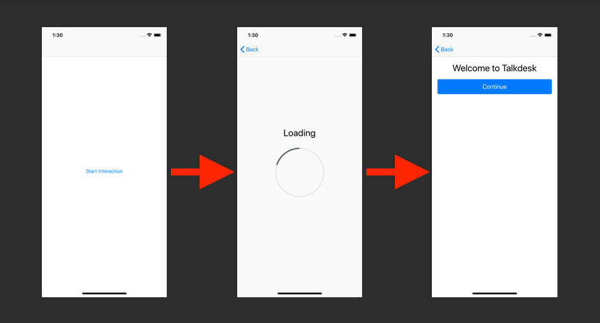

# Talkdesk SDK iOS Integration Example
This repository contains a simple iOS project that integrates with Talkdesk SDK in order to run an interaction. It implements the application-specific part of the [authorization mechanism](http://mobile-dev.talkdeskapp.com/ios/docs/release/0.5.0/authorization.html) of the SDK and can be used with the [Talkdesk SDK Ruby Server Sample](https://www.github.com/Talkdesk/mobile-sdk-ruby-server-sample).

## How to Run

1. Check out the [Talkdesk SDK Ruby Server Sample](https://www.github.com/Talkdesk/mobile-sdk-ruby-server-sample) and follow the instructions to run it locally using the account-specific [OAuth client secrets](https://docs.talkdesk.com/docs/auth) provided by Talkdesk.
2. Make sure you have the latest **Xcode** and **Cocoapods** installed. Check out the project and run `pod install` on the root folder.
3. Open **SDKSample.xcworkspace** and navigate to `AuthorizationController.swift` under the **Service configuration** mark. Fill the values for the Basic Auth username and password in `authorizationUsername` and `authorizationPassword`.
4. Update the `authorizationEndpoint` value accordingly if you have made changes to the Ruby Server Sample code that affect the endpoint it is running on. Replace `localhost` with the machine's IP address if you intend to run it in a different device (rather than a simulator).
5. Run the app on a simulator or device and tap "**Start Interaction**". You should see the following message and screen:

5. If this is not what you are seeing, here is a quick troubleshooting checklist:

   1. **Is the server running and reachable?** Make sure the Ruby Server Sample is running on the same network as your device or simulator. You can use a proxy such as [Charles](https://www.charlesproxy.com) to make sure the request is being made and to verify its contents.

   2. **Does the server return a 201 status code?** Check the logs of the Ruby Server Sample. Did it receive a request when you pressed the button? What status code did it respond with? If the status code is not 201, check the service configuration both on the Server Sample (`.env`) and app.
